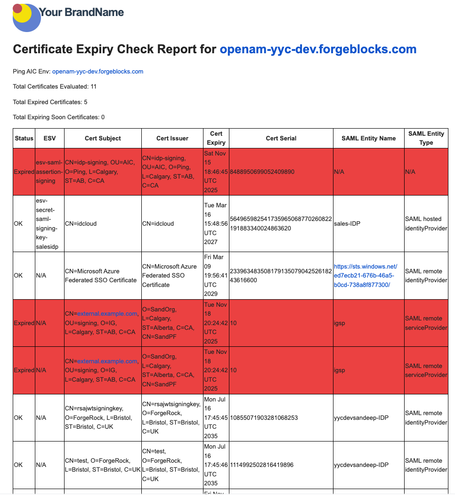

## Automating Certificate Expiry Analysis in PingOne AIC Environments

Managing certificate lifecycles in a large-scale Identity and Access Management (IAM) deployments can be a daunting task. If a SAML signing or encryption certificate expires silently, it can lead to abrupt service outages and broken federations.

To solve this, we can leverage a robust automation script designed specifically for PingOne AIC (P1AIC) Platform. This README will walk you through the script's capabilities, its primary use cases, and a step-by-step guide to deploying it in your environment.

---

### Detailed Description

This Certificate Expiry Analysis script is designed to run within a P1AIC environment. It performs a comprehensive audit of your SAML certificates by executing the following functions:

* **Secret Fetching:** It fetches all secrets from the Google Secret Manager Secret Store Provider and isolates the ones containing PEM-encoded certificates.
* **Certificate Parsing:** It parses the PEM blocks to extract critical attributes, including the Subject, Issuer, NotBefore date, NotAfter date, and Serial Number.
* **Expiry Evaluation:** It checks the expiry status of every certificate against the current date and a configurable warning threshold (defaulted to 10 days).
* **Entity Correlation:** It correlates these certificates to their associated SAML entities (both Identity Providers and Service Providers) based on your realm configuration. It handles both hosted providers (referencing secret IDs) and remote providers (parsing raw XML metadata).
* **Reporting and Notification:** It generates a detailed report highlighting expired or soon-to-expire certificates and dispatches an email notification to configured administrators using AIC's external email service.

### Use Case

**Proactive SAML Federation Maintenance:** The primary use case for this script is to prevent federation outages. In a P1AIC environment handling dozens or hundreds of SAML integrations, manually tracking certificate expiration dates across hosted ESVs and remote metadata XMLs is error-prone. This script acts as an automated watchdog, proactively alerting your Identity team (e.g., the Ping Identity PS Team) before a certificate expires, giving them ample time to rotate credentials.

---

### Prerequisites

Before deploying the script, ensure your environment meets the following requirements:

* **Service Account:** A dedicated P1AIC service account ID and corresponding private key JWK with the necessary permissions. It requires the scope `fr:am:* fr:idc:esv:read` to read secrets from ESVs and access realm configurations in AM.
* **ESVs:** A ESV variable containing the script's primary configuration and an ESV secret containing the service account's private key JWK.
* **Email Service:** P1AIC's external email service must be configured to send outbound notifications.
* **Email Template:** An email template in P1AIC for the notification email.
* **Scheduled Job:** A scheduled job which runs the script periodically.
---

### Step-by-Step Instructions

Follow these steps to configure and execute the certificate expiry analysis script as a scheduled job:

#### Step 1: Configure the Service Account
Create a service account in your P1AIC environment. Note its ID (e.g., `a7a656e2-db72-4324-b402-5b68dce6cab8`) and save the private key JWK in a secure location.

#### Step 2: Set Up the Configuration ESV varaible
Create an ESV variable, named `esv-pingps-cert-status-config`, of type `Object` and paste the following JSON. Please change the values as needed:

```json
{
  "onlySendEmailIfActionNeeded": false,
  "onlyIncludeProblematicCertsInEmail": false,
  "emailTemplate": "pingPsCertificateStatusCheck",
  "emailRecipients": "admin@yourdomain.com",
  "emailFromAddress": "noreply@yourdomain.com",
  "warningDays": 10,
  "serviceAccountId": "YOUR-SERVICE-ACCOUNT-CLIENT-ID",
  "serviceAccountJwk": "esv.pingps.cert.status.service.account.jwk",
  "scope": "fr:am:* fr:idc:esv:read",
  "envFqdn": "your-tenant.forgeblocks.com",
  "logprefix": "pingpslog: Ping PS Certificate Expiry Checking System: "
}
```

#### Step 3: Set Up the ESV secret
Create an ESV secret, named `esv-pingps-cert-status-service-account-jwk` of type `generic`. Paste the value of the service account's private key JWK.

#### Step 4: Configure the Email Template
1. Create a new email template named `Ping PS Certificate Status Check` (or whatever you defined in your config JSON).
2. Paste the HTML template provided. The template uses Handlebars-style templating (`{{object.title}}`, `{{#each object.rows}}`) to generate a styled table with red rows for expired certificates and yellow rows for warnings.

#### Step 5: Deploy and Schedule the Script
1.  Create a new "Script" type scheduled job and paste the contents of `certificate-expiry-analysis.js` script.
2.  Configure a Scheduled Job to run at a desired frequency (running daily is recommended). For running it daily at 2:00am local time, please use the following cron configuration: `0 0 2 * * ?`
3.  Monitor the logs. The script includes a custom logger utility that prepends your configured `logprefix` to all messages (e.g., debug, info, warn, error) for easy traceability.

Once running, the script will systematically process all mapping configurations, parse metadata XMLs, and ensure your team is never caught off guard by an expired SAML certificate again.

### Sample email

